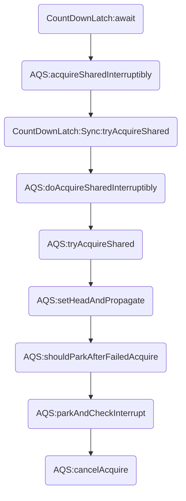

# CountDownLatch 初识

CountDownLatch 能够使一个线程在等待另外一些线程完成各自工作之后，再继续执行。
相当于一个计数器，当计数器为0时，代表所有线程运行完毕，然后在此上等待的线程（CountDownLatch.await）就可以恢复执行接下来的任务。


# CountDownLatch 使用


CountDownLatch提供了一个构造方法，你必须指定其初始值（计数器的值）。有一个<font color=red>countDown</font>方法，这个方法的作用就是用来减小计数器的值，当计数器的值减为 0 时，在CountDownLatch上<font color=red>await</font>方法的线程就会被唤醒，继续执行任务。这里也支持延迟唤醒。

## CountDownLatch 用法演示

通过下面小demo演示下CountDownLatch的用法，场景介绍：五个小伙伴准备吃火锅，需要准备肉菜、蔬菜、饮料、底料以及其他，所以五个人每人一个任务，当所有人完成任务就可以开始吃火锅了

```java

public class CountDownLatchTest {

    public static void main(String[] args) {
        //这里赋值计数器的值为 5 ，表示需要5次任务
        CountDownLatch cdl = new CountDownLatch(5);
        Person xm = new Person("小明", "肉菜", cdl);
        Person xz = new Person("小张", "蔬菜", cdl);
        Person xl = new Person("小李", "饮料", cdl);
        Person xw = new Person("小王", "底料", cdl);
        Person lz = new Person("楼主", "其他的", cdl);
        System.out.println("开始进行任务");
        ExecutorService service = Executors.newCachedThreadPool();
        service.execute(xl);
        service.execute(xm);
        service.execute(xz);
        service.execute(xw);
        service.execute(lz);
        try {
            //这里做等待，当cdl的count值为 0 时，表示任务都已经完成了，将被唤醒并继续执行
            cdl.await();
        } catch (InterruptedException e) {
            e.printStackTrace();
        }
        System.out.println("可以开始吃火锅了");
        service.shutdown();
    }


}

class Person implements Runnable {

    private String name;
    private String doSth;
    private CountDownLatch countDownLatch;

    public Person(String name, String doSth, CountDownLatch countDownLatch) {
        this.name = name;
        this.doSth = doSth;
        this.countDownLatch = countDownLatch;
    }

    @Override
    public void run() {
        Random random = new Random();
        int i = random.nextInt(1000);
        try {
            TimeUnit.MILLISECONDS.sleep(1000 + i);
        } catch (InterruptedException e) {
            e.printStackTrace();
        }
        System.out.println(this.name + "准备好" + this.doSth + "了");
        //完成任务后执行countDown表示完成一个任务
        countDownLatch.countDown();
    }
}
```

 输出结果:

```
开始进行任务
小张准备好蔬菜了
小李准备好饮料了
小明准备好肉菜了
小王准备好底料了
楼主准备好其他的了
可以开始吃火锅了
```

这里我们把五个任务分配到5个线程中，“吃火锅”主线程执行 <font color=red>await</font> 等待所有任务执行完成，才能继续执行下去

## 使用场景

由上面的demo可以总结到使用场景，多线程任务下，某个线程需要等到其他线程任务结束才能继续执行时，可以使用CountDownLatch；


# CountDownLatch 源码分析

从上面可以看出，CountDownLatch的使用方法很简单，一个  <font color=red>await</font> 在配合  <font color=red>countDown</font>方法即可。

下面认识一下CountDownLatch。

CountDownLatch的底层是由 AbstractQueuedSynchronizer支持，而AQS的数据结构的核心是两个队列：<font color=red>同步队列（sync queue）</font>、<font color=red>条件队列（condition queue）</font>。

## Sync 内部类

CountDownLatch·在其内部是一个Sync ，它继承了AQS抽象类

```java
private static final class Sync extends AbstractQueuedSynchronizer {...}
```

CountDownLatch其内部只有一个<font color=red>sync</font>属性，并且是final修饰的，在实例化是初始化该属性

```java
private final Sync sync;
```

CountDownLatch 只有一个带参数的构造方法

```java
	/**
     * Constructs a {@code CountDownLatch} initialized with the given count.
     *
     * @param count the number of times {@link #countDown} must be invoked
     *        before threads can pass through {@link #await}
     * @throws IllegalArgumentException if {@code count} is negative
     */
    public CountDownLatch(int count) {
        if (count < 0) throw new IllegalArgumentException("count < 0");
        this.sync = new Sync(count);
    }
```

也就是说，初始化的时候必须指定计数器的值，并且不能为负数。

然后把count初始化为Sync内部的count

```java
 	Sync(int count) {
    	setState(count);
    }
```

Sync会将count赋值到**AbstractQueuedSynchronizer**的 *state* 上, *state* 是由 volatile 修饰的，表示了其内存可见性

```java
	/**
     * The synchronization state.
     */
    private volatile int state;
	/**
     * Sets the value of synchronization state.
     * This operation has memory semantics of a {@code volatile} write.
     * @param newState the new state value
     */
    protected final void setState(int newState) {
        state = newState;
    }
  	/**
     * Returns the current value of synchronization state.
     * This operation has memory semantics of a {@code volatile} read.
     * @return current state value
     */
    protected final int getState() {
        return state;
    }
```


<font color=orange>getCount()</font> 方法的返回值是<font color=orange>getState()</font>方法，它是AbstractQueuedSynchronizer中的方法，这个方法会返回当前线程计数 state。

<font color=orange>`tryAcquireShared()`</font> 方法用于获取共享状态下对象的状态，判断对象是否为 0 ，如果为 0 返回 1 ，表示能够尝试获取，如果不为 0，那么返回 -1，表示无法获取。

```java
protected int tryAcquireShared(int acquires) {
  return (getState() == 0) ? 1 : -1;
}
```

这个<font color=orange> `共享状态` </font>属于 AQS 中的概念，在 AQS 中分为两种模式，一种是 <font color=orange>`独占模式`</font>，一种是<font color=orange> `共享模式`</font>。

- tryAcquire 独占模式，尝试获取资源，成功则返回 true，失败则返回 false。
- tryAcquireShared 共享方式，尝试获取资源。负数表示失败；0 表示成功，但没有剩余可用资源；正数表示成功，且有剩余资源。

<font color=orange>`tryReleaseShared()`</font> 方法用于共享模式下的释放

```java
protected boolean tryReleaseShared(int releases) {
  // 减小数量，变为 0 的时候进行通知。
  for (;;) {
    int c = getState();
    if (c == 0)
      //表示已经释放
      return false;
     //释放掉一个，计数器减 1个 判断是否为0
    int nextc = c-1;
    if (compareAndSetState(c, nextc))
      return nextc == 0;
  }
}
```

这个方法是一个无限循环，获取线程状态，如果线程状态是 0 则表示没有被线程占有，没有占有的话那么直接返回 false ，表示已经释放；然后下一个状态进行 - 1 ，使用 compareAndSetState CAS 方法进行和内存值的比较，如果内存值也是 1 的话，就会更新内存值为 0 ，判断 nextc 是否为 0 ，如果 CAS 比较不成功的话，会再次进行循环判断。

```java
    protected final boolean compareAndSetState(int expect, int update) {
        // See below for intrinsics setup to support this
        return unsafe.compareAndSwapInt(this, stateOffset, expect, update);
    }
```

> AQS 不太了解的可以看这里：[AQS](https://www.bilibili.com/video/BV1d54y1671v?from=search&seid=8885377574844473898)
> CAS : [告诉你一个 AtomicInteger 的惊天大秘密！](https://mp.weixin.qq.com/s/vbXAgNH9PyL16PmjgnGKZA)


## await 方法

<font color=orange>`await()`</font> 方法是 CountDownLatch 一个非常重要的方法，基本上可以说只有 countDown 和 await 方法才是 CountDownLatch 的精髓所在，这个方法将会使当前线程在 CountDownLatch 计数减至零之前一直等待，除非线程被中断。

CountDownLatch 中的 await 方法有两种，一种是不带任何参数的 <font color=orange>`await()`</font>，一种是可以等待一段时间的<font color=orange>`await(long timeout, TimeUnit unit)`</font>。下面我们先来看一下  await() 方法。

```java
public void await() throws InterruptedException {
  sync.acquireSharedInterruptibly(1);
}
```

await 方法内部会调用 acquireSharedInterruptibly 方法，这个 acquireSharedInterruptibly 是AQS 中的方法，以共享模式进行中断。

```java
    public final void acquireSharedInterruptibly(int arg)
            throws InterruptedException {
        if (Thread.interrupted())
            throw new InterruptedException();
        if (tryAcquireShared(arg) < 0)
            doAcquireSharedInterruptibly(arg);
    }
```

可以看到，acquireSharedInterruptibly 方法的内部会首先判断线程是否<font color=red>中断</font>,如果线程中断，则直接抛出线程中断异常。如果没有中断，那么会以共享的方式获取。如果能够在共享的方式下不能获取锁，那么就会以共享的方式断开连接。

```java
    /**
     * Acquires in shared interruptible mode.
     * @param arg the acquire argument
     */
    private void doAcquireSharedInterruptibly(int arg)
        throws InterruptedException {
        final Node node = addWaiter(Node.SHARED);
        boolean failed = true;
        try {
            for (;;) {
                final Node p = node.predecessor();
                if (p == head) {
                    int r = tryAcquireShared(arg);
                    if (r >= 0) {
                        setHeadAndPropagate(node, r);
                        p.next = null; // help GC
                        failed = false;
                        return;
                    }
                }
                if (shouldParkAfterFailedAcquire(p, node) &&
                    parkAndCheckInterrupt())
                    throw new InterruptedException();
            }
        } finally {
            if (failed)
                cancelAcquire(node);
        }
    }

```

* 首先，构造一个共享模式的Node 入队
* 使用无限循环判断新构造node前驱节点，如果node节点的前驱节点是头结点，那么就会判断线程的状态，这里调用了一个setHeadAndPropagate

```java
    private void setHeadAndPropagate(Node node, int propagate) {
        Node h = head; // Record old head for check below
        setHead(node);
        /*
         * Try to signal next queued node if:
         *   Propagation was indicated by caller,
         *     or was recorded (as h.waitStatus either before
         *     or after setHead) by a previous operation
         *     (note: this uses sign-check of waitStatus because
         *      PROPAGATE status may transition to SIGNAL.)
         * and
         *   The next node is waiting in shared mode,
         *     or we don't know, because it appears null
         *
         * The conservatism in both of these checks may cause
         * unnecessary wake-ups, but only when there are multiple
         * racing acquires/releases, so most need signals now or soon
         * anyway.
         */
        if (propagate > 0 || h == null || h.waitStatus < 0 ||
            (h = head) == null || h.waitStatus < 0) {
            Node s = node.next;
            if (s == null || s.isShared())
                doReleaseShared();
        }
    }

```

首先会设置头节点，然后进行一系列的判断，获取节点的下一个，以共享模式进行释放，就会调用 doReleaseShared 方法

```java

    /**
     * Release action for shared mode -- signals successor and ensures
     * propagation. (Note: For exclusive mode, release just amounts
     * to calling unparkSuccessor of head if it needs signal.)
     */
    private void doReleaseShared() {
        /*
         * Ensure that a release propagates, even if there are other
         * in-progress acquires/releases.  This proceeds in the usual
         * way of trying to unparkSuccessor of head if it needs
         * signal. But if it does not, status is set to PROPAGATE to
         * ensure that upon release, propagation continues.
         * Additionally, we must loop in case a new node is added
         * while we are doing this. Also, unlike other uses of
         * unparkSuccessor, we need to know if CAS to reset status
         * fails, if so rechecking.
         */
        for (;;) {
            Node h = head;
            if (h != null && h != tail) {
                int ws = h.waitStatus;
                if (ws == Node.SIGNAL) {
                    if (!compareAndSetWaitStatus(h, Node.SIGNAL, 0))
                        continue;            // loop to recheck cases
                    unparkSuccessor(h);
                }
                else if (ws == 0 &&
                         !compareAndSetWaitStatus(h, 0, Node.PROPAGATE))
                    continue;                // loop on failed CAS
            }
            if (h == head)                   // loop if head changed
                break;
        }
    }
```

这个方法会以无限循环的方式首先判断头节点是否等于尾节点，如果头节点等于尾节点的话，就会直接退出。如果头节点不等于尾节点，会判断状态是否为 SIGNAL，不是的话就继续循环 compareAndSetWaitStatus，然后断开后继节点。如果状态不是  SIGNAL，也会调用 compareAndSetWaitStatus 设置状态为 PROPAGATE，状态为 0 并且不成功，就会继续循环。

也就是说 setHeadAndPropagate 就是设置头节点并且释放后继节点的一系列过程。

- 我们来看下面的 if 判断，也就是 `shouldParkAfterFailedAcquire(p, node) ` 这里

```java
if (shouldParkAfterFailedAcquire(p, node) &&
    parkAndCheckInterrupt())
    throw new InterruptedException();
```

如果上面 Node p = node.predecessor() 获取前驱节点不是头节点，就会进行 park 断开操作，判断此时是否能够断开，判断的标准如下

```java
    private static boolean shouldParkAfterFailedAcquire(Node pred, Node node) {
        int ws = pred.waitStatus;
        if (ws == Node.SIGNAL)
            /*
             * This node has already set status asking a release
             * to signal it, so it can safely park.
             */
            return true;
        if (ws > 0) {
            /*
             * Predecessor was cancelled. Skip over predecessors and
             * indicate retry.
             */
            do {
                node.prev = pred = pred.prev;
            } while (pred.waitStatus > 0);
            pred.next = node;
        } else {
            /*
             * waitStatus must be 0 or PROPAGATE.  Indicate that we
             * need a signal, but don't park yet.  Caller will need to
             * retry to make sure it cannot acquire before parking.
             */
            compareAndSetWaitStatus(pred, ws, Node.SIGNAL);
        }
        return false;
    }
```

这个方法会判断 Node p 的前驱节点的<font color=orange>`结点状态(waitStatus)`</font>，节点状态一共有五种，分别是

1. <font color=orange>`CANCELLED(1)`</font>：表示当前结点已取消调度。当超时或被中断（响应中断的情况下），会触发变更为此状态，进入该状态后的结点将不会再变化。
2. <font color=orange>`SIGNAL(-1)`</font>：表示后继结点在等待当前结点唤醒。后继结点入队时，会将前继结点的状态更新为 SIGNAL。
3. <font color=orange>`CONDITION(-2)`</font>：表示结点等待在 Condition 上，当其他线程调用了 Condition 的 signal() 方法后，CONDITION状态的结点将**从等待队列转移到同步队列中**，等待获取同步锁。
4. <font color=orange>`PROPAGATE(-3)`</font>：共享模式下，前继结点不仅会唤醒其后继结点，同时也可能会唤醒后继的后继结点。
5. <font color=orange>`0`</font>：新结点入队时的默认状态。

如果前驱节点是SIGNAL就会返回true表示可以断开，如果前驱节点的状态大于0，就会一系列的查找遍历操作直到前驱节点的waitStatus>0.如果ws>0，而且还不是SIGNAL状态的话，就会使用CAS 替换前驱节点的ws状态为SIGNAL。

如果检查短片是中断状态，就返回false。

```java
private final boolean parkAndCheckInterrupt() {
  LockSupport.park(this);
  return Thread.interrupted();
}
```

这个方法使用 <font color=orange>`LockSupport.park`</font>断开连接，然后返回线程是否中断的标志。

* <font color=orange>`cancelAcquire`</font>用于取消等待队列，如果等待过程中没有成功获取资源，那么取消结点在队列中的等待。

```java
private void cancelAcquire(Node node) {
  if (node == null)
    return;

  node.thread = null;
  
  Node pred = node.prev;
  while (pred.waitStatus > 0)
    node.prev = pred = pred.prev;

  Node predNext = pred.next;

  node.waitStatus = Node.CANCELLED;

  if (node == tail && compareAndSetTail(node, pred)) {
    compareAndSetNext(pred, predNext, null);
  } else {
    int ws;
    if (pred != head &&
        ((ws = pred.waitStatus) == Node.SIGNAL ||
         (ws <= 0 && compareAndSetWaitStatus(pred, ws, Node.SIGNAL))) &&
        pred.thread != null) {
      Node next = node.next;
      if (next != null && next.waitStatus <= 0)
        compareAndSetNext(pred, predNext, next);
    } else {
      unparkSuccessor(node);
    }
    node.next = node; // help GC
  }
}
```

所以，对 CountDownLatch 的 await 调用大致会有如下的调用过程。



一个和await重载的方式 `await(long timeout, TimeUnit unit)`，这个方法和await 最重要的区别就是这个方法能够可以等待计数器一段时间再执行后续操作。

## countDown 方法

countDown和await同等重要的方法，countDown用于减少计数器的值，如果计数器的值为0时，就会释放所有的线程

```java
public void countDown() {
  sync.releaseShared(1);
}
```

这个方法会调用releaseShared方法，此方法用于共享模式下的释放操作，首先会判断是否能够进行释放，释放判断的方法就是CountDownLatch内部类Sync的tryReleaseShared方法。

```java
public final boolean releaseShared(int arg) {
  if (tryReleaseShared(arg)) {
    doReleaseShared();
    return true;
  }
  return false;
}

// ---- CountDownLatch ----

protected boolean tryReleaseShared(int releases) {
  for (;;) {
    int c = getState();
    if (c == 0)
      return false;
    int nextc = c-1;
    if (compareAndSetState(c, nextc))
      return nextc == 0;
  }
}
```

tryReleaseShared会进行for循环判断线程状态值，使用CAS不断尝试进行替换。

如果能释放，会就调用doReleaseShared方法。

```java
private void doReleaseShared() {
  for (;;) {
    Node h = head;
    if (h != null && h != tail) {
      int ws = h.waitStatus;
      if (ws == Node.SIGNAL) {
        if (!compareAndSetWaitStatus(h, Node.SIGNAL, 0))
          continue;            // loop to recheck cases
        unparkSuccessor(h);
      }
      else if (ws == 0 &&
               !compareAndSetWaitStatus(h, 0, Node.PROPAGATE))
        continue;                // loop on failed CAS
    }
    if (h == head)                   // loop if head changed
      break;
  }
}

```

可以看到，doReleaseShared方法其实也是无限循环不断使用CAS尝试替换操作。


> 搬运文档：[一文搞懂 CountDownLatch 用法和源码！](https://juejin.cn/post/6908510385691852813)